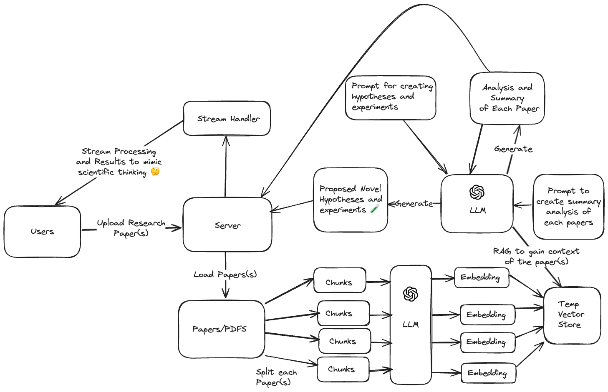

# Scientific Thinking Model (STM)

This project is a tool that models novel scientific thinking.

## Demo

Check out the demo video to see the Scientific Thinking Model in action or [live here](https://scientific-thinking-model.vercel.app/):

https://www.loom.com/share/2f6a86c3ffe24904940e79f9c19a7f12?sid=bbaa02c7-bbbf-4fe2-9c5b-82f6e0ecd836

## Features

- Users upload pdfs of research papers
- Research papers are converted to embeddings and stored in temp vector store for Retrievel Augmented Generation
- LLM is prompted to think scientifically about the research papers and detail its analysis step by step
- Then it synthesizes the analysis of the papers to create a novel hypotheses and corresponding experiments step by step

## Architecture



## Getting Started

To run this project locally, follow these steps:

1. Clone the repository
2. Install dependencies:
   ```bash
   npm install
   ```
3. Start the development server:
   ```bash
   npm run dev
   ```
4. Open [http://localhost:3000](http://localhost:3000) in your browser

## Issues

- On the live link you are not able to upload pdf file larger than 5mb

## Contributing

Contributions are welcome! Please feel free to submit a Pull Request.

## License

This project is open source and available under the [MIT License](LICENSE).
